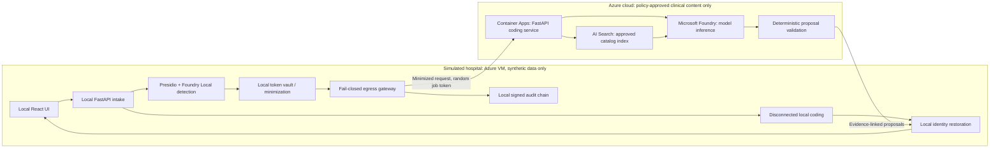

# Architecture and decisions

Status: proposed design, agreed stack and diagnosis-only scope.
Decision date: 2026-09-14. Sources: [research register](research.md).

## Boundary-first topology

Cloud responses must return through local validation and job-token resolution;
the diagram is not an unrestricted direct connection to the UI.

## Component choices

| Component | MVP decision | Reason / limit |
| --- | --- | --- |
| Simulated hospital | One Azure VM; second only for a proven OS/runtime need | Small demo footprint, separate trust zone; not genuine premises |
| Foundry Local | Runtime/VM compatibility spike before choosing image/SKU | CPU path first; measure latency; do not assume GPU/WinML works in any VM |
| Detection | Local Presidio plus local-model span proposals | Complementary signals, neither guarantees perfect detection |
| Vault | Local encrypted store, separate local key protection | No Azure Key Vault/Managed HSM storage of hospital identity mappings or keys |
| Egress | One gateway with explicit request schema and destination allowlist | Serializes and checks the exact bytes transmitted |
| API/orchestration | FastAPI on Azure Container Apps | Explicit bounded workflow, no autonomous clinical agent |
| Retrieval | Azure AI Search over approved diagnosis catalog only | Filter by pack, system, version, locale; never index patient notes |
| Inference | Microsoft Foundry regional deployment where available | Model/version selected only after region, quota and retention checks |
| Validation | Shared Python library in the cloud API, checked again locally | No separate Functions service needed for MVP |
| Cloud secrets | Managed identity and Key Vault if a secret is unavoidable | Cloud credentials only; separate from hospital vault |
| Observability | Allowlisted operational metrics | No request/response body capture or note-derived exception text |
| Audit | Local signed, hash-linked events; independent checkpoints | No SQL Ledger required for initial demo; does not prove detection completeness |

The original Managed HSM-in-the-local-vault label is not adopted: a cloud key
service would not be a strictly on-premises vault. Production hardware-backed
local key storage is a separate design and procurement decision.

Use Bicep for reproducible infrastructure after approval. Isolate the mock
hospital network from cloud services. No public RDP/SSH open to the internet.
Provision dependencies/models before switching to restricted egress. Deny
runtime internet access except the approved gateway path; validate DNS, redirects,
proxy handling, IPv6 and SDK telemetry, not just an application URL check.

## What crosses

Outbound: short-lived random job token, pack/version IDs, minimized narrative,
allowlisted clinical facts, and evidence offsets into that minimized narrative.
The exact envelope is a future executable contract, not yet implemented.

Never outbound: raw FHIR bundle, original patient IDs, names, exact birth dates,
addresses, encounter identifiers, vault mappings, original-text offsets that
reveal removed content, raw logs, or re-identification keys.

A local evidence map links redacted spans back to original spans. Re-identification
resolves a job token in the local vault; never blindly replace arbitrary model
output tokens. Reject output for the wrong job, pack, version, or schema.

## Extensibility without country branches

Select `country + care_setting + code_system + edition + locale + posture`.
Country is not a complete legal policy: hospital policy, canton/state and use
case may impose stricter conditions. Overlays may tighten, not silently weaken.

Proposed interfaces:

- `JurisdictionPack`: version, locales, coding profiles, source references.
- `BoundaryPolicy`: supported input fields, transformations, detector requirements,
  uncertainty behavior and approved processing locations.
- `CatalogProvider`: imports operator-supplied official files, verifies provenance,
  exposes candidate retrieval and version/effective-date lookup.
- `RuleValidator`: explicit catalog-specific rules with evidence and rule IDs;
  configuration for data, reviewed adapters for genuinely different algorithms.
- `InferenceProvider`: local/cloud transport behind the same structured contract.
- `AuditSink`: canonical envelope commitment, decision, signer, version, checkpoint.

Packs are data, not executable untrusted plugins. Unknown values, unavailable
catalogs, incompatible versions, or unapproved terms must stop processing.
The committed pack examples are **design contracts**, not approved legal policy
or runtime egress authorization.

## Residency and disconnected mode

The initial candidate CH region is Switzerland North; US region selection is
pending model availability. Configuration must check actual model deployment
type: a regional resource hosting Global inference is not region-bound inference.
Never fall back from a Swiss regional requirement to EU or Global processing.

For one small live deployment, demonstrate the other country's pack locally if
its cloud processing location is unavailable. Label this honestly; do not imply
a country dropdown moves deployed Azure resources.

Disconnected mode uses preloaded local models and catalogs, makes no cloud calls,
and labels results degraded and human-review-required. Unsupported local inference
is an explicit unavailable state, not fabricated successful coding.
